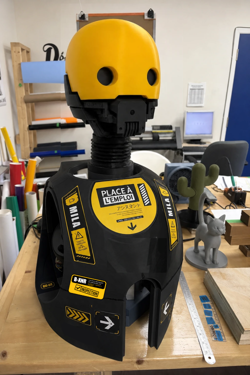

# Mila — Une tête robotisée servant comme assistant de laboratoire

Le Projet **Mila** est une initiative de l'organisme [Place à l'emploi](https://placealemploi.ca/) de Longueuil dans le cadre du plateau d'exploration professionnel nommé **Robo-Tic**. Ce plateau exploratoire est destiné à des personnes sans emploi et qui ne sont pas aux études afin de leur permettre de développer de nouvelles compétences et d'expérimenter concrètement de nouveaux outils utiles sur le marché. Le but de **Mila** est de permettre l'exploration du domaine de la robotique de base aux participants.

## Qu'est-ce que le projet **Mila** ?

**Mila** est une tête imprimée en 3D qui détecte et suit le visage d'un passant en **temps réel (souple)**. C'est grâce à une caméra miniature et deux servomoteurs donnant une mobilité à une tête de robot verticalement et horizontalement. La tête de robot est également dotée d'yeux animés avec deux écrans LCD.

L'activation vocale et l'uniformité de la séquence d'allumages sont des fonctionnalités en cours de développement. (2026-09-08)

## Documentation

[Lien vers la documentation du projet](./docs/home.md)

<!--  -->

## Image du projet

