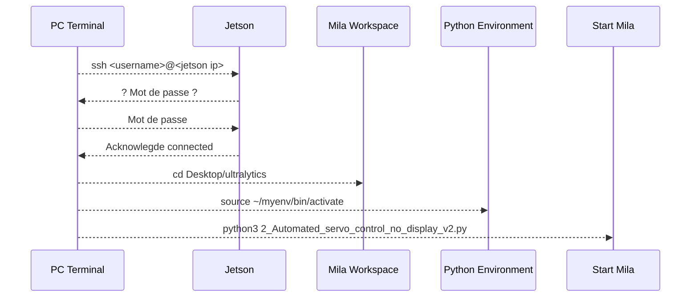
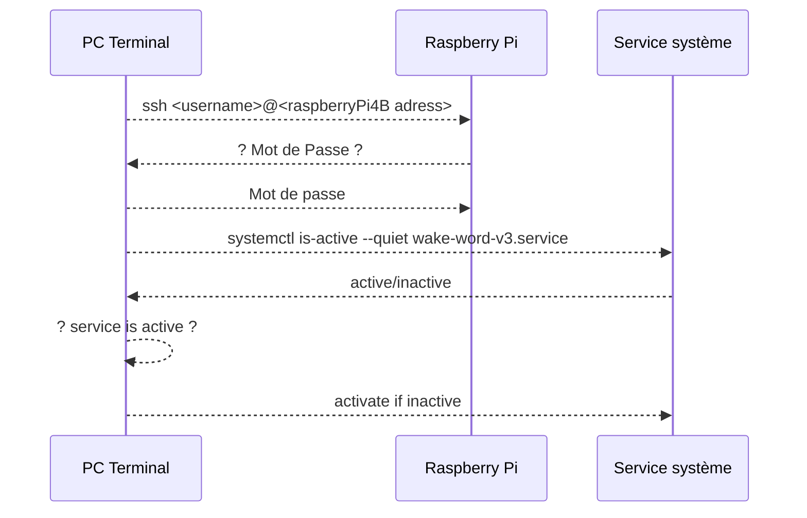

# 0 Procédure de lancement manuel

## 0.1 Procédure de démarage de base (sans voix)

Les deux périphériques (Jetson et Raspberry Pi) doivent être connecter sur le même réseau wifi/Ethernet que votre ordinateur (PC).

### A) Jetson

1. Brancher l'alimentation du Jetson (cable avec ruban **ROUGE**).
2. Exécution des commande de démarage via SSH avec un Terminal sur un PC dans le même réseau que le Jetson.

```bash
ssh <username>@<jetson adress>
# Entrer le mot de passe
cd Desktop/ultralytics
source ~/myenv/bin/activate
python3 2_Automated_servo_control_no_display_v2.py
```



### B) Raspberry Pi 4B

1. Brancher le cable d'alimentation (cable avec ruban **VERT**)
2. Exécution des commande de démarage via SSH avec un Terminal sur un PC dans le même réseau que le Raspberry Pi.
3. Vérifier si le service wake-word-v3 est actif ou non.
    - Si service est inactif, activer le service de démarage via un Terminal sur votre PC avec SSH dans le même réseau que le Raspberry Pi

```bash
ssh <username>@<raspberryPi4B adress>
# Entrer le mot de passe
sudo systemctl is-active --quiet wake-word-v3.service || sudo systemctl start wake-word-v3.service
```



## 0.2 Procédure de démarage avec la voix (non fonctionnel)

### A) Jetson — gestionnaire de commandes

```bash
ssh <username>@<jetson-ip>
source /home/<username>/wake_word_env/bin/activate
cd Desktop/wake-word-handler
python wake_word_handler.py
```

### B) RPi 4B — détecteur de wake word

```bash
ssh <username>@<rpi-ip>
source ~/porcupine_env/bin/activate
cd Desktop
python wake_word_v3.py --access_key "<PICOVOICE_ACCESS_KEY>" \
  --keyword_paths <hey-mila.ppn> <mila-stop.ppn> --audio_device_index 0
```

> Rappel : démarrer le Jetson (broker) avant le RPi (client).

## Retour à la table des matières

[Table des matières](../home.md)